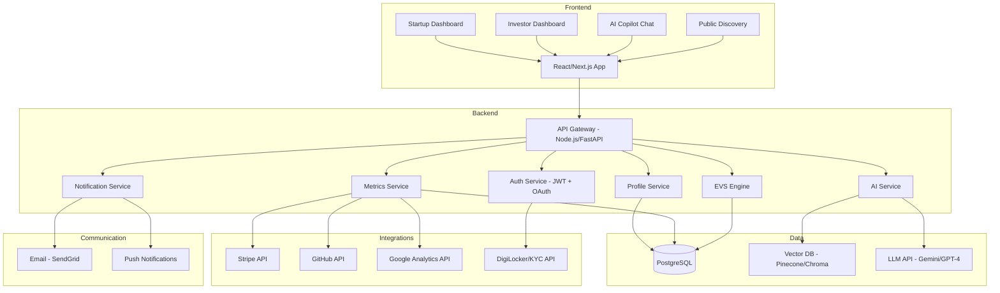

# FounderProof — The Evidence-Driven Startup Investment Platform

> *Where startup credibility is earned through verified execution, not pitched through slides.*

---

## Platform Name Suggestion: **FounderProof**

*(Alternatives: TractionLayer, ProveKit, ExecutionOS)*

---

## 1. Problem Statement

Early-stage startup investing is broken.

**For investors**, the current process relies on polished pitch decks, charismatic founders, and gut instinct — not on verified execution data. Once money is deployed, most investors receive infrequent, cherry-picked updates (if any at all). Over 75% of equity crowdfunding investors report frustration with post-investment communication, and there is no standardized way to track whether a startup is actually executing on its promises.

**For startups**, fundraising is an opaque, relationship-driven process that penalizes first-time founders, underrepresented teams, and builders who lack VC networks — regardless of the quality of their product or execution.

**The gap no one has filled:**

| What Exists Today | What's Missing |
|---|---|
| Crowdfunding platforms (Republic, Wefunder) let anyone invest | No ongoing transparency requirements after funding — startups can ghost investors |
| Investor reporting tools (Visible.vc, Standard Metrics) collect metrics | Metrics are self-reported, optional, and only visible to existing investors — not for discovery |
| Startup databases (Crunchbase, PitchBook) list companies | Static snapshots of funding data — no execution velocity, no credibility scores |
| AI research tools (Harmonic.ai, Energent.ai) help VCs source deals | Enterprise-only, external data only — no access to verified internal startup metrics |

**FounderProof combines all four layers — verified transparency, investor intelligence, AI-driven research, and micro-funding — into one ecosystem where credibility is continuously earned, not one-time pitched.**

---

## 2. Core Vision

FounderProof is the **credibility infrastructure layer** for early-stage startup investing.

The platform creates an evidence-driven investment ecosystem where:

- **Startups prove execution** through verified, continuous metrics — not just pitch decks
- **Investors make decisions** backed by data, AI analysis, and execution history — not gut instinct
- **Trust is algorithmic** — computed from verified third-party data, not self-reported claims

### Target Users

| User | Primary Need |
|---|---|
| **Startups** (Seed to Pre-Series A) | Prove credibility, access funding, maintain investor relations |
| **Investors** (Angel, Micro-fund, VC Scout) | Discover vetted startups, make data-backed decisions, monitor portfolio |

### Target Geography (V1)

> [!IMPORTANT]
> **V1 targets India-based startups and investors**, operating under SEBI guidelines and the Companies Act 2013. The platform does NOT directly process investment transactions in V1 — it serves as a credibility and intelligence layer that integrates with existing funding rails (e.g., AngelList India, LetsVenture, or direct SAFE execution via legal partners). This sidesteps securities registration requirements while delivering full platform value.

---

## 3. Core Features

### 3.1 Structured Startup Profiles

Every startup has a standardized, investor-optimized profile:

| Section | Content | Verification |
|---------|---------|-------------|
| **Company Overview** | Description, sector, stage, founding date | Manual review |
| **Pitch** | 1-minute video OR structured written pitch (founder's choice) | AI quality check |
| **Product** | Product overview, demo link/screenshots, tech stack | Link validation |
| **Market** | TAM/SAM/SOM analysis, competitive landscape | AI cross-reference |
| **Traction** | Core KPIs — revenue, users, growth rate, retention | **API-verified** (see 3.3) |
| **Team** | Founder backgrounds, LinkedIn verification, team size | **Identity-verified** |
| **Financials** | Burn rate, runway, funding raised to date | **API-verified** |
| **Roadmap** | Quarterly milestones with delivery tracking | Platform-tracked |
| **Funding Ask** | Amount, instrument (SAFE/equity), valuation cap, use of funds | Standardized template |

> **What changed from original:** Pitch video is no longer mandatory — founders can choose between video or a structured written pitch with AI-assisted formatting. This removes bias against non-native English speakers and introverted technical founders.

---

### 3.2 Execution Velocity Score (EVS) — The Startup Credit Score

> [!TIP]
> **This is the single most differentiating feature.** No existing platform has a dynamic, real-time credibility score for startups.

Every startup receives a continuously computed **Execution Velocity Score (0–100)** based on its real-time data inputs. The score is recomputed instantly whenever a verified metric (Stripe, GitHub, etc.) updates, ensuring investors see the most current credibility signal. It is based on:

| Signal | Weight | Source |
|--------|--------|--------|
| **Metric Trajectory** — Are core KPIs growing? | 25% | API-verified data |
| **Update Consistency** — How regularly does the startup report? | 20% | Platform activity |
| **Milestone Delivery** — Did they hit what they promised? | 20% | Roadmap vs. actual |
| **Founder Responsiveness** — Response time to investor queries | 10% | Platform activity |
| **Data Verification Level** — How many metrics are API-verified vs. self-reported? | 15% | Integration status |
| **Community Signals** — Investor interest, questions, watchlist additions | 10% | Platform activity |

**Score behavior:**
- **Score rises** when startups consistently update, hit milestones, and show verified growth
- **Score decays** when startups go silent, miss milestones, or disconnect verified data sources
- **Score is publicly visible** — investors can sort and filter startups by EVS
- **Score history is permanent** — investors can see trajectory over time

**EVS Tiers:**

| Score | Tier | Perks |
|-------|------|-------|
| 0–30 | 🔴 **Unverified** | Listed but not eligible for platform funding features |
| 31–50 | 🟡 **Emerging** | Eligible for micro-funding, basic investor matching |
| 51–75 | 🟢 **Credible** | Featured placement, AI recommendation eligible, investor alerts |
| 76–100 | 🏆 **Institutional Ready** | Premium visibility, "FounderProof Certified" badge, VC deal room access |

> **Loopholes addressed:** Replaces the arbitrary 14-day credibility period with a continuous, multi-signal system that is much harder to game. A startup can't fake API-verified Stripe revenue or GitHub commits over 60+ days.

---

### 3.3 Zero-Trust Verified Metrics (API Integrations)

> [!IMPORTANT]
> **This is what makes FounderProof's transparency different from every competitor.** Republic and Wefunder rely entirely on self-reported data. FounderProof verifies at the source.

Startups can connect third-party data sources for automatic, tamper-proof metric verification:

| Data Source | What It Verifies | Badge |
|-------------|-----------------|-------|
| **Stripe / Razorpay** | Revenue, MRR, transaction volume | 💰 Revenue Verified |
| **Google Analytics / Mixpanel / PostHog** | User count, DAU/MAU, retention | 📊 Users Verified |
| **GitHub / GitLab** | Commit frequency, contributors, release cadence | 🛠️ Engineering Verified |
| **App Store Connect / Google Play Console** | Downloads, ratings, active installs | 📱 App Verified |
| **LinkedIn (OAuth)** | Team size, founder employment history | 👤 Team Verified |
| **Social Media APIs** | Follower growth, engagement rate | 📣 Audience Verified |

**How it works:**
1. Startup connects data source via OAuth (read-only access)
2. Platform pulls metrics automatically on a weekly cadence
3. Metrics are displayed with a "Verified ✓" badge alongside any self-reported data
4. Verification status directly impacts EVS score

**Privacy guardrails:**
- Startups control WHICH metrics are public vs. investor-only
- Absolute numbers can be hidden — only growth rates/trends shown publicly (e.g., "40% MoM revenue growth" instead of "₹2.3L MRR")
- Raw data is never shared — only computed metrics and trends

> **Loopholes addressed:** Solves adverse selection (strong startups won't share exact numbers) by allowing percentage-based disclosure. Solves post-funding ghosting by making metrics automatic. Solves self-reporting trust issues by verifying at source.

---

### 3.4 Transparency Model (Public vs. Stakeholder)

FounderProof uses a streamlined visibility model to balance public discovery with stakeholder privacy:

#### Tier 1 — Public Discovery & Analysis (Everyone)
Available to any visitor, designed for startup discovery and community engagement:
- **Company Overview & Pitch**: Description, video/written pitch, and sector/stage info.
- **EVS Score & Traction Trends**: Live Execution Velocity Score with growth trend indicators.
- **Verification Badges**: Count and type of API-verified data sources.
- **Public Engagement**: Anyone can **upvote** startups and leave **comments/questions** on their public feed.
- **Follow System**: Users can "follow" startups to receive public update notifications.

#### Tier 2 — Stakeholder View (Direct Investors)
Available only to individuals who have invested in the startup via the platform:
- **Full Traction Data**: Detailed charts showing absolute revenue, user numbers, and churn.
- **Internal Roadmaps**: Granular milestone tracking and internal strategic plans.
- **Founder Communications**: Access to private updates and automated stakeholder emails.
- **Direct Messaging**: 1-on-1 channel with the founding team.
- **Financial Details**: Burn rate, runway, and capitalization table.

> **Loopholes addressed:** Combining public and investor views ensures high discovery potential while protecting sensitive financial data for those who have skin in the game.

---

### 3.5 14-Day Status Verification

The platform maintains a simple "Valid Status" check to ensure startups are active and credible:

- **Day 0-14**: Startup is in "Verified" status as long as a progress update is posted or an API metric syncs.
- **The 14-Day Gate**: Startups must provide at least one verified data point or a manual update every 14 days to maintain their "Active" badge.
- **Status Validation**: This simple check replaces complex layers, providing a binary signal to the public: Is this startup executing *right now*?

> **Loopholes addressed:** Replaces complex tiered systems with a simple, high-frequency "heartbeat" check that prevents ghosting and keeps the platform's data fresh.

**Credibility decay rules:**
- No update for 14 days → Warning notification to startup
- No update for 30 days → EVS penalty (-5 points), "Inactive" warning badge
- No update for 60 days → Level demotion, investor alert triggered
- No update for 90 days → Public "Dormant" status, removed from active listings

> **Loopholes addressed:** 14-day period is now a minimum entry bar, not a one-time gate. Credibility must be continuously maintained. Decay mechanics prevent ghost startups. Levels are tied to verifiable actions, not just time.

---

### 3.6 AI Due Diligence Copilot

The AI Copilot provides instant, data-backed analysis for any startup on the platform. It processes verified metrics, founder updates, and community sentiment to generate insights.

#### Key AI Capabilities

- **Startup Scoring**: Real-time breakdown of the EVS score with reasoning.
- **Comparison Engine**: Side-by-side analysis of multiple startups.
- **Risk Detection**: Automated flagging of inconsistencies between claims and verified data.
- **Momentum Tracking**: Identifying "Rising Stars" based on sudden inflection points in API data.

#### Specific AI Capabilities

| Capability | Input Data | Output | Frequency |
|-----------|-----------|--------|-----------|
| **Startup Scoring** | EVS signals, verified metrics, milestones | Structured score breakdown with reasoning | Real-time |
| **Startup Comparison** | Multiple startup profiles + investor preferences | Side-by-side comparison with recommendation ranking | On-demand |
| **Momentum Detection** | Time-series metrics across all startups | "Rising Stars" alerts — startups showing inflection | Weekly |
| **Inconsistency Flagging** | Stated milestones vs. actual metrics | Red flag alerts (e.g., "Claims 10K users but GA shows 2K") | Continuous |
| **Weekly Portfolio Digest** | Funded startup metrics + updates | Automated investor newsletter per portfolio | Weekly |
| **Sector Research** | Platform data + public market data | Sector landscape reports with platform startup mapping | Monthly |
| **Thesis Matching** | Investor preference profile + startup pool | Personalized "Top 5 Startups for You" recommendations | Weekly |

#### Guardrails Against Hallucination
- Every AI claim must cite a specific data source (verified metric, update, or milestone)
- Confidence scores are mandatory — low-confidence outputs are flagged
- AI never says "invest" or "don't invest" — it provides analysis, not advice
- Disclaimer on every output: "This is algorithmic analysis, not investment advice"
- Human-in-the-loop escalation for borderline cases

> **Loopholes addressed:** AI is no longer vague — it has defined inputs, outputs, architecture, and guardrails. The unique data advantage (proprietary verified platform data) is articulated clearly.

---

### 3.7 Investor-Startup Matching Engine

Investors build a **preference profile** that the platform uses for intelligent matching:

| Preference Dimension | Example Values |
|----------------------|----------------|
| Sector focus | Fintech, HealthTech, EdTech, SaaS, D2C |
| Stage preference | Idea, MVP, Revenue, Scaling |
| Check size range | ₹50K – ₹5L, ₹5L – ₹25L, ₹25L+ |
| Risk appetite | Conservative (EVS > 60), Moderate (EVS > 40), Aggressive (all) |
| Growth threshold | Min MoM growth rate (e.g., >15%) |
| Verification level | Only API-verified metrics, or self-reported OK |
| Geography | City/state preference within India (V1) |
| Founder background | Technical, Business, Domain Expert, Repeat Founder |

**Matching outputs:**
- Weekly personalized startup recommendations via email/in-app
- "New on Platform" alerts for startups matching investor criteria
- "Breaking Out" alerts when a watchlisted startup crosses a metric threshold
- Sector briefings when a critical mass of startups emerges in a new vertical

---

### 3.8 Automated Founder-to-Stakeholder Communication

FounderProof automates the relationship management between founders and their investors. Instead of manual monthly emails, the platform triggers automated updates *from the founder* to their stakeholders:

| Communication | Trigger | Content | Channel |
|--------------|---------|---------|---------|
| **Weekly Founder Digest** | Every Monday | Automated summary of the founder's recent progress, core metric movements, and the upcoming week's focus. | Email |
| **Milestone Celebration** | Milestone completion | A "Founders Note" explaining the impact of the newly delivered milestone. | Email + App |
| **KPI Pulse** | Significant growth/drop | A proactive explanation from the system (on behalf of the founder) regarding metric fluctuations. | Push + Email |
| **Transparency Alert** | No update for 14 days | Automated nudge to the founder to post an update, with a warning to stakeholders if the deadline is missed. | Email |

**Ghost Detection System:**

```
Day 0-14:  Normal cadence
Day 14:    ⚠️ System sends startup a "gentle reminder" to update
Day 21:    ⚠️ System sends second reminder + notifies startup of pending flag
Day 30:    🟡 "Inactive" badge appears on startup profile, investors notified
Day 45:    🟠 EVS penalty applied (-10 points), investors receive formal alert
Day 60:    🔴 Startup demoted one credibility level
Day 90:    ⛔ "Dormant" status, removed from active discovery, all investors alerted
```

> **Loopholes addressed:** Post-funding ghosting is no longer possible without visible consequences. Investors get automated updates regardless of startup cooperation (via API-verified data). Ghost detection creates accountability.

---

### 3.9 Simplified Investment Framework

FounderProof simplifies the funding process by acting as a direct bridge between capital and execution.

- **Payment Gateway Integration**: Investments are processed via standard payment gateways (Razorpay/Stripe) into a dedicated project wallet.
- **SAFE Contracts**: Standardized Simple Agreement for Future Equity (SAFE) contracts are auto-generated and digitally signed upon transaction.
- **Direct Fund Flow**: Capital moves directly from the investor to the startup's verified account, recorded on the platform for transparency.


---


---


---

## 5. Competitive Moat

| Moat Type | How It's Built |
|-----------|---------------|
| **Proprietary Data** | Every day the platform operates, it accumulates verified startup execution data that no competitor has access to. This data compounds — 12 months of verified metrics for 500 startups is an irreplicable asset. |
| **Network Effects** | More startups → better AI recommendations → more investors → more funding → more startups. Both sides of the marketplace reinforce each other. |
| **EVS as Standard** | If EVS becomes the accepted credibility metric (like a FICO score for startups), switching costs become enormous — founders won't abandon years of credibility history. |
| **API Verification Infrastructure** | Building integrations with Stripe, GitHub, Analytics, etc. creates a technical moat that's expensive and time-consuming to replicate. |

---

## 6. What We Explicitly Do NOT Build in V1

| Excluded Feature | Reason |
|-----------------|--------|
| Third-user contributor/advisor ecosystem | Adds complexity, dilutes core value prop |
| Token/crypto-based systems | Regulatory complexity, unnecessary for V1 |
| Public advice/reward systems | Risk of becoming a social platform |
| Secondary market for shares | Requires separate securities registration |
| Multi-country support | Each jurisdiction needs separate legal compliance |
| Full KYC/AML infrastructure | Use partner APIs (DigiLocker, NSDL) instead |

---

## 7. Technical Architecture (Hackathon Scope)



---

## 8. Hackathon Demo Scope (What to Actually Build)

> [!TIP]
> Build 4 screens deep, not 20 screens wide.

### Must Build (Demo-Ready)
1. **Startup Profile Page**: Featuring EVS score, verified badges, time-series charts, and a **public feed for upvotes and comments**.
2. **Investor Discovery Dashboard**: Combined view with search/filter by EVS, sector, and growth rate + community engagement signals.
3. **AI Insight Panel**: Instant analysis of startup performance with risk flags and momentum detection.
4. **Automated Update Feed**: Showing simulated "Founder-to-Stakeholder" emails and status updates.

### Mock / Simulate
- API integrations (use realistic mock data that simulates Stripe/GitHub responses)
- KYC verification flow (simulate with test data)
- Email notifications (show templates, don't send)
- SAFE agreement generation (show PDF preview)

### Skip Entirely
- Payment processing
- Real OAuth flows for third-party APIs
- Mobile app
- Admin panel

---

## 9. Success Metrics (How Judges Evaluate)

| Metric | Target (Demo) |
|--------|--------------|
| Time for investor to evaluate a startup | < 3 minutes (vs. 30+ min reading a pitch deck) |
| Startups with EVS > 50 in demo dataset | 60% (showing the system differentiates quality) |
| AI recommendation accuracy (on demo data) | Recommendations align with manual analysis |
| Ghost detection triggering correctly | 100% of simulated inactive startups flagged |
| Investor-startup match relevance | Matched startups align with stated preferences |

---

## 10. One-Line Pitch

> **"FounderProof is the CIBIL score for startups — a platform where credibility is earned through verified execution, giving investors AI-powered, evidence-driven funding decisions with built-in milestone-based capital protection."**

*(CIBIL reference works well for Indian hackathon judges — it's instantly understood as "credit score for startups")*
